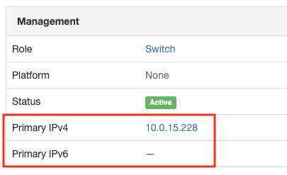

# NetSpyGlass - Netbox integration

This tool can be used to synchronize devices between [Netbox](https://github.com/netbox-community/netbox) DCIM 
and [NetSpyGlass](https://www.netspyglass.com) (NSG). Synchronization is unidirectional, that is, devices are 
copied from Netbox to NSG. The tool supports simple whitelist and blacklist filters based on Netbox
device tags and can run in the background, checking and synchronizing devices at specified interval.

## Installation and Setup

### Docker

You can run this tool using our public Docker image:

    docker run -d --restart=always happygears/netspyglass-netbox:latest ./nsg-netbox.py <command line arguments>

This will make docket detach from the shell and restart the process should it crash for any reason. Nothing will 
appear to the standard output. All diagnostic information is written to the log, which  you can retrieve using
standard `docker logs <container_id>` command

### Install using pip

This tool uses `pynetbox` Python module that you can install using pip:

    pip install pynetbox

The tool requires Python 3. If your system uses Python 2.7 as the default, you'll need
to install Python3 and run pip like this

    pip3 install pynetbox

### Authentication

You will need URL and access token for both Netbox and NSG to set up authentication.

See excellent series on [Przemek Rogala's blog](https://ttl255.com/pynetbox-netbox-python-api-client-p1-getting-info/) 
for more details on `pynetbox` and detailed instructions for how to obtain Netbox authentication tokens

## Usage

    $ ./nsg-netbox.py  -h
    usage: nsg-netbox.py [-h] --netbox-url NETBOX_URL --netbox-token NETBOX_TOKEN
                         --nsg-url NSG_URL --nsg-token NSG_TOKEN --channel CHANNEL
                         [--whitelist WHITELIST] [--blacklist BLACKLIST]
                         [--netid NETID] [--interval INTERVAL]
    
    optional arguments:
      -h, --help            show this help message and exit
      --netbox-url NETBOX_URL
      --netbox-token NETBOX_TOKEN
      --nsg-url NSG_URL
      --nsg-token NSG_TOKEN
      --channel CHANNEL     NetSpyGlass communication channel name to use with all
                            imported devices
      --whitelist WHITELIST
                            the name of the Netbox device tag that will be passed
                            to `dcim.devices.filter()` call to filter devices in
                            Netbox. Only devices that have this tag will be
                            synchronized to NetSpyGlass. Default is None, which
                            causes all devices present in Netbox to be
                            synchronized. At this time this can be only a single
                            tag name. Example: "--whitelist=nsg"
      --blacklist BLACKLIST
                            the name of the Netbox device tag that will be passed
                            to `dcim.devices.filter()` call to filter devices in
                            Netbox. Devices that have this tag will not be
                            synchronized to NetSpyGlass. Blacklist filter is
                            applied after the whitelist (if any). Default is None,
                            which turns this off and causes all devices that pass
                            whitelist will be synchronized. At this time this can
                            be only a single tag name. Example: "--
                            blacklist=nsg_ignore"
      --netid NETID         NetSpyGlass network id, usually "1" (default=1)
      --interval INTERVAL   Poll Netbox and NetSpyGlass at this interval (in
                            seconds). (default=300)
      --log-dir LOG_DIR     Directory where the log will be created

Parameter `--channel` describes communication channel NSG will use to poll devices added
by this tool. All added devices are assumed to support the same channel. See 
[NSG documentation](http://docs.netspyglass.com/3.0.x/nsg_agent.html#configuration-file-channels-conf) for more details.
 
Suppose your agent runs with the default `channels.conf` configuration file (it shouldn't)
which defines the following channels:

    network {
        channels = {

            v1public : {
                protocol : snmp,
                version : 1,
                community : public
            },

            v2public : {
                protocol : snmp,
                version : 2,
                community : public
            },

            v3md5public : {
                protocol : snmp,
                version : 3,
                secLevel : authNoPriv,
                auth : MD5,
                user : snmpuser,
                password : public
            },

        }
    }

In this case you could use 'v1public', 'v2public' or 'v3md5public' as the value for the paramete `--channel`.
Note that only one channel can be used and it will apply to all devices imported from Netbox. In practical
terms, this means that all these devices should have the same SNMP configuration (same SNMP version and the community
for v1 and v2, or same credentials for SNMP v3)

The `whitelist` and `blacklist` parameters take single word as a value, which is expected
to be a Netbox device tag. If parameter `--whitelist` is provided, only devices that have 
the whitelist tag will be added to NSG. If this paramete is missing, all devices found in
Netbox will be synchronized. Blacklist is applied after the whitelist and can be used to
suppress some of the devices even if they pass the whitelist filter.

Use parameter `--interval` to specify synchronization interval.

The tool, once started, does not detach itself from the shell in which it runs and
runs in the loop until stopped.

## Synchronization

The tool polls Netbox and NSG at specified interval, collects list of devices defined in both systems
and compares them. If a device that matches filtering criteria (whitelist and blacklist, if any) appears
in Netbox but is missing in NSG, it will be added to NSG. If a device still present in NSG disappears in Netbox,
after whitelist and blacklist filters are applied, it will be deleted in NSG. 

*Devices are matched by their IP address, using `primary_ip` attribute of the device in Netbox*

At this time, only devices with Status=`Active` are copied. Device will be automatically removed from
NSG if its status changes from `Active` to any other.

## Logging

The tool produces the log of its activity and writes it to the standard output. This makes it easier to
run on docker where you can use command `docker logs` to retrieve the log for analysis.

## Examples

    ./nsg-netbox.py --netbox-url=$NB_URL --netbox-token=$NB_TOKEN \
                    --nsg-url=$NSG_URL --nsg-token=$NSG_TOKEN \
                    --channel=v2public

this command will synchronize all devices between Netbox and NSG at 5 min interval (the default),
adding polling channel 'v2public' to all devices it adds to NSG. Note that the channel name
'v2public' must match one of the channels configured in NSG agent.

    ./nsg-netbox.py --netbox-url=$NB_URL --netbox-token=$NB_TOKEN \
                    --nsg-url=$NSG_URL --nsg-token=$NSG_TOKEN \
                    --channel=v2public \
                    --whitelist=nsg

The same as the above but only devices with Netbox device tag `nsg` will be synchronized

    ./nsg-netbox.py --netbox-url=$NB_URL --netbox-token=$NB_TOKEN \
                    --nsg-url=$NSG_URL --nsg-token=$NSG_TOKEN \
                    --channel=v2public \
                    --whitelist=nsg \
                    --blacklist=nsg_ignore

Only devices with Netbox device tag `nsg` will be synchronized, unless they also have tag `nsg_ignore`.
This setup allows you to mark a broad set of devices to synchronize, but then remove a few of them
if necessary, for example if they are under extended maintenance or have been taken offline temporarily 
for any other reason

    docker run -d --restart=always happygears/netspyglass-netbox:latest ./nsg-netbox.py \
                    --netbox-url=$NB_URL --netbox-token=$NB_TOKEN \
                    --nsg-url=$NSG_URL --nsg-token=$NSG_TOKEN \
                    --channel=v2public \
                    --whitelist=nsg \
                    --blacklist=nsg_ignore

The same configuration as the above, but running on docker

